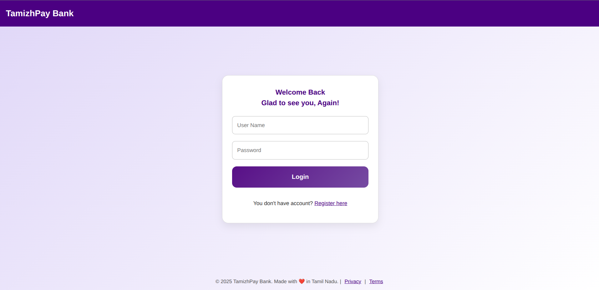
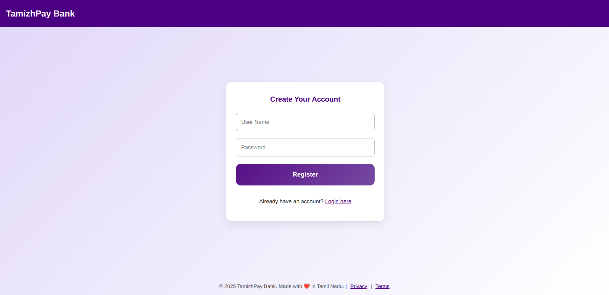
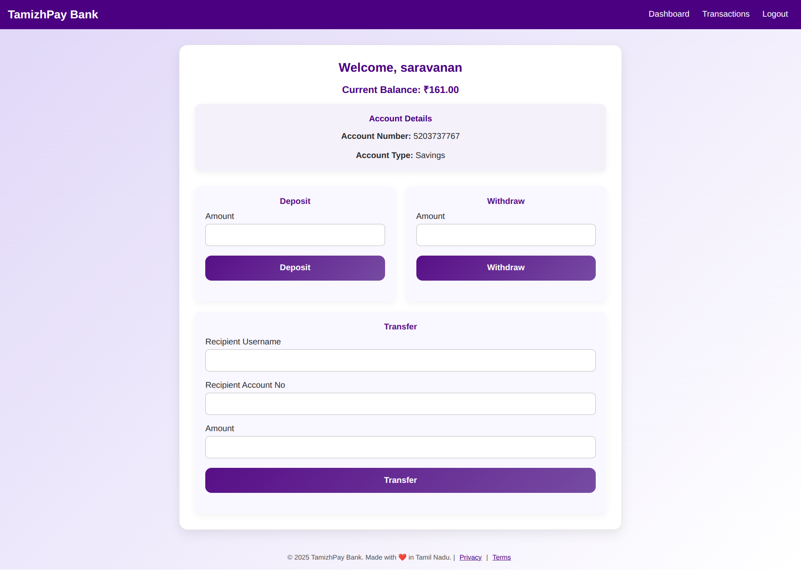

# 🏦 Bank Application

A simple and secure banking web application developed using **Spring Boot**, **Spring Security**, and **Thymeleaf**. This application allows users to create an account, log in, deposit and withdraw money, and view account details.

## 📸 Demo






## 🚀 Features

- ✅ User Registration and Login with Spring Security
- 💰 Deposit and Withdraw Money
- 🧾 View Account Balance
- 📄 Thymeleaf Templates for UI
- 🛡️ BCrypt Password Encryption
- 💾 MySQL Database Integration

## 🧰 Tech Stack

| Layer              | Technology                          |
|--------------------|-------------------------------------|
| Backend            | Java, Spring Boot                   |
| Frontend           | Thymeleaf, HTML, CSS, JavaScript    |
| Security           | Spring Security                     |
| Database           | MySQL                               |
| ORM                | Spring Data JPA                     |
| Build Tool         | Maven                               |
| IDE                | IntelliJ / VS Code                  |

---

## 🏗️ Project Structure

BankApplication
├── src/main/java
│ ├── controller
│ ├── entity
│ ├── repository
│ ├── service
│ ├── configuration
├── src/main/resources
│ ├── templates/
│ ├── static/
│ ├── application.properties
├── screenshots/
├── README.md

---

## 🔧 Setup Instructions

### 1. Clone the Repository

```bash
git clone https://github.com/imsaravanan7/BankApplication.git
cd BankApplication
